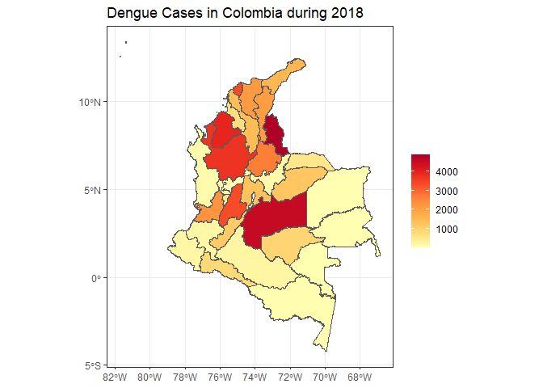

<!-- README.md is generated from README.Rmd. Please edit that file. -->
<!-- The code to render this README is stored in .github/workflows/render-readme.yaml -->
<!-- Variables marked with double curly braces will be transformed beforehand: -->
<!-- `packagename` is extracted from the DESCRIPTION file -->
<!-- `gh_repo` is extracted via a special environment variable in GitHub Actions -->

# ColOpenData 

<!-- badges: start -->

[](https://opensource.org/license/mit/)
[](https://github.com/epiverse-trace/ColOpenData/actions/workflows/R-CMD-check.yaml)
[](https://app.codecov.io/gh/epiverse-trace/ColOpenData?branch=main)
[](https://www.reconverse.org/lifecycle.html#concept)
<!-- badges: end -->

ColOpenData is a package that acquires, standardizes, and wrangles
Colombian socioeconomic, climate and land cover data. It solves the
problem of Colombian data being issued in different web pages and
formats by using functions that allow the user to select the desired
database and download it without having to do the exhausting acquisition
process. Also, it allows these datasets to be merged so multiple
operations, such as calculating statistics, can be made, taking into
account information from different datasets.

<!-- This sentence is optional and can be removed -->

ColOpenData is developed at [Universidad de Los
Andes](https://uniandes.edu.co/) as part of the [Epiverse-TRACE
program](https://data.org/initiatives/epiverse/).

## Installation

You can install the development version of ColOpenData from
[GitHub](https://github.com/) with:

``` r
# install.packages("pak")
pak::pak("epiverse-trace/ColOpenData")
```

## Quick start

This example shows how to retrieve census data at a department level in
Colombia including the administrative divisions and spatial data, to
later use it to visualize Dengue cases during 2018. We will first load
the needed packages.

``` r
library(ColOpenData)
library(sf)
library(dplyr)
library(ggplot2)
library(RColorBrewer)
```

We will be using the `MGNCNPV_DPTO_2018` dataset, which contains the
National Geo statistical Framework (MGN) and the National Population and
Living Census (CNPV) at department level for 2018.

To load the dataset we can use the `download` function as follows.

``` r
census <- download("MGNCNPV_DPTO_2018")
#> Warning in readLines(con, warn = readLines.warn): incomplete final line found
#> on 'C:\Users\Julia\AppData\Local\R\win-library\4.3\ColOpenData\config.yaml'

#> Warning in readLines(con, warn = readLines.warn): incomplete final line found
#> on 'C:\Users\Julia\AppData\Local\R\win-library\4.3\ColOpenData\config.yaml'
str(census)
#> Classes 'sf' and 'data.frame':   33 obs. of  89 variables:
#>  $ DPTO_CCDGO: chr  "18" "19" "86" "76" ...
#>  $ DPTO_CNMBR: chr  "CAQUETÁ" "CAUCA" "PUTUMAYO" "VALLE DEL CAUCA" ...
#>  $ VERSION   : num  2018 2018 2018 2018 2018 ...
#>  $ AREA      : num  9.01e+10 3.12e+10 2.60e+10 2.07e+10 7.13e+10 ...
#>  $ LATITUD   : num  0.799 2.397 0.452 3.859 2.728 ...
#>  $ LONGITUD  : num  -74 -76.8 -75.9 -76.5 -68.8 ...
#>  $ STCTNENCUE: num  163381 622959 147797 1674673 13059 ...
#>  $ STP3_1_SI : num  1117 83033 4704 18250 3675 ...
#>  $ STP3_2_NO : num  162264 539926 143093 1656423 9384 ...
#>  $ STP3A_RI  : num  1117 70827 4659 3618 3675 ...
#>  $ STP3B_TCN : num  0 12206 45 14632 0 ...
#>  $ STP4_1_SI : num  544 226 1389 21431 532 ...
#>  $ STP4_2_NO : num  162837 622733 146408 1653242 12527 ...
#>  $ STP9_1_USO: num  132937 446806 107456 1410067 11111 ...
#>  $ STP9_2_USO: num  5429 10837 3397 39096 293 ...
#>  $ STP9_3_USO: num  24804 165011 36789 224820 1553 ...
#>  $ STP9_4_USO: num  211 324 173 690 102 101 204 29 131 103 ...
#>  $ STP9_2_1_M: num  96 328 67 1920 12 12 248 12 0 39 ...
#>  $ STP9_2_2_M: num  3860 6147 2572 22705 154 ...
#>  $ STP9_2_3_M: num  1117 2276 717 11986 106 ...
#>  $ STP9_2_4_M: num  243 2016 29 2357 6 ...
#>  $ STP9_2_9_M: num  113 70 12 128 15 14 8 36 14 47 ...
#>  $ STP9_3_1_N: num  160 810 188 5572 15 ...
#>  $ STP9_3_2_N: num  5422 10334 4402 50097 244 ...
#>  $ STP9_3_3_N: num  2511 9455 2485 40191 263 ...
#>  $ STP9_3_4_N: num  3052 43342 6665 32665 24 ...
#>  $ STP9_3_5_N: num  1250 3515 1428 5452 149 ...
#>  $ STP9_3_6_N: num  10099 86486 18445 67080 597 ...
#>  $ STP9_3_7_N: num  678 3155 368 6881 35 ...
#>  $ STP9_3_8_N: num  12 105 74 169 7 3 52 9 0 2 ...
#>  $ STP9_3_9_N: num  96 969 319 1340 5 6 227 3 2 4 ...
#>  $ STP9_3_10 : num  1453 6596 2334 14970 206 ...
#>  $ STP9_3_99 : num  71 244 81 403 8 6 45 22 1 16 ...
#>  $ STVIVIENDA: num  138366 457643 110853 1449163 11404 ...
#>  $ STP14_1_TI: num  115307 372096 90540 902928 8577 ...
#>  $ STP14_2_TI: num  18322 33837 11052 490230 690 ...
#>  $ STP14_3_TI: num  3591 18177 8098 52855 311 ...
#>  $ STP14_4_TI: num  493 30035 684 1173 1697 ...
#>  $ STP14_5_TI: num  35 2187 49 518 34 ...
#>  $ STP14_6_TI: num  618 1311 430 1459 95 ...
#>  $ STP15_1_OC: num  110525 367793 91508 1231570 9364 ...
#>  $ STP15_2_OC: num  4306 24327 3418 64873 72 ...
#>  $ STP15_3_OC: num  7299 32268 5761 41444 660 ...
#>  $ STP15_4_OC: num  16236 33255 10166 111276 1308 ...
#>  $ TSP16_HOG : num  116166 432493 107053 1267039 9953 ...
#>  $ STP19_EC_1: num  93242 336910 70944 1216379 5822 ...
#>  $ STP19_ES_2: num  17283 30883 20564 15191 3542 ...
#>  $ STP19_EE_1: num  70029 228576 58033 321720 3421 ...
#>  $ STP19_EE_2: num  16659 51555 9096 438056 1401 ...
#>  $ STP19_EE_3: num  3868 22577 1002 295053 144 ...
#>  $ STP19_EE_4: num  523 10705 46 84368 5 ...
#>  $ STP19_EE_5: num  20 2682 15 54589 3 ...
#>  $ STP19_EE_6: num  7 564 37 16599 1 ...
#>  $ STP19_EE_9: num  2136 20251 2715 5994 847 ...
#>  $ STP19_ACU1: num  80362 239233 47315 1174360 2047 ...
#>  $ STP19_ACU2: num  30163 128560 44193 57210 7317 ...
#>  $ STP19_ALC1: num  72630 163290 49898 1119657 2621 ...
#>  $ STP19_ALC2: num  37895 204503 41610 111913 6743 ...
#>  $ STP19_GAS1: num  40608 101100 13261 1003741 0 ...
#>  $ STP19_GAS2: num  67966 264114 77496 218169 9364 ...
#>  $ STP19_GAS9: num  1951 2579 751 9660 0 ...
#>  $ STP19_REC1: num  80237 163693 54930 1156676 3615 ...
#>  $ STP19_REC2: num  30288 204100 36578 74894 5749 ...
#>  $ STP19_INT1: num  16740 57774 9947 683961 693 ...
#>  $ STP19_INT2: num  91374 307230 80704 537450 8442 ...
#>  $ STP19_INT9: num  2411 2789 857 10159 229 ...
#>  $ STP27_PERS: num  359602 1243503 283197 3789874 44431 ...
#>  $ STPERSON_L: num  11260 7969 5720 27645 6849 ...
#>  $ STPERSON_S: num  348342 1235534 277477 3762229 37582 ...
#>  $ STP32_1_SE: num  182378 615833 142900 1800614 23214 ...
#>  $ STP32_2_SE: num  177224 627670 140297 1989260 21217 ...
#>  $ STP34_1_ED: num  63844 198781 47232 460691 11162 ...
#>  $ STP34_2_ED: num  78433 224899 60789 571709 12028 ...
#>  $ STP34_3_ED: num  62230 218267 51033 632594 7334 ...
#>  $ STP34_4_ED: num  50014 184644 42216 556818 5070 ...
#>  $ STP34_5_ED: num  39637 141446 32710 489478 3781 ...
#>  $ STP34_6_ED: num  31396 119102 23515 468483 2749 ...
#>  $ STP34_7_ED: num  19015 81959 14118 325926 1327 ...
#>  $ STP34_8_ED: num  10148 48453 7828 183070 739 ...
#>  $ STP34_9_ED: num  4885 25952 3756 101105 241 ...
#>  $ STP51_PRIM: num  113225 434283 85979 851033 18602 ...
#>  $ STP51_SECU: num  24649 195877 30892 446077 2788 ...
#>  $ STP51_SUPE: num  17680 105690 20987 636722 2227 ...
#>  $ STP51_POST: num  904 7288 501 44248 28 ...
#>  $ STP51_13_E: num  17844 56673 11058 111703 2545 ...
#>  $ STP51_99_E: num  10238 17057 5630 49860 1886 ...
#>  $ Shape_Leng: num  21.4 14 12.7 12.7 21.2 ...
#>  $ Shape_Area: num  7.32 2.53 2.11 1.68 5.75 ...
#>  $ geometry  :sfc_MULTIPOLYGON of length 33; first list element: List of 1
#>   ..$ :List of 1
#>   .. ..$ : num [1:33205, 1:2] -74.9 -74.9 -74.9 -74.9 -74.9 ...
#>   ..- attr(*, "class")= chr [1:3] "XY" "MULTIPOLYGON" "sfg"
#>  - attr(*, "sf_column")= chr "geometry"
#>  - attr(*, "agr")= Factor w/ 3 levels "constant","aggregate",..: NA NA NA NA NA NA NA NA NA NA ...
#>   ..- attr(*, "names")= chr [1:88] "DPTO_CCDGO" "DPTO_CNMBR" "VERSION" "AREA" ...
```

Once downloaded, we can subset the data by regions or columns of
interest. In this example we only need the departments codes and
geometries.

``` r
south_col <- census %>%
  select(DPTO_CCDGO, geometry)
```

Dengue cases during 2018 can be loaded from the example dataset
`dengue_2018`, which was previously obtained using the package
[sivirep](https://epiverse-trace.github.io/sivirep/).

``` r
dengue_cases <- dengue_2018
str(dengue_cases)
#> tibble [34 × 2] (S3: tbl_df/tbl/data.frame)
#>  $ DPTO_CCDGO: chr [1:34] "00" "01" "05" "08" ...
#>  $ CASES     : int [1:34] 4 407 3737 3298 1395 96 47 191 177 2103 ...
```

To merge the datasets we will use the department’s codes.

``` r
dengue_south <- merge(
  x = south_col,
  y = dengue_2018,
  by = "DPTO_CCDGO"
)
```

Finally, we can visualize the cases in a map.

``` r
ggplot(data = dengue_south) +
  geom_sf(mapping = aes(fill = CASES)) +
  scale_fill_gradientn(
    colours = brewer.pal(7, "YlOrRd"),
    name = element_blank()
  ) +
  ggtitle("Dengue Cases in Colombia during 2018") +
  theme_bw()
```



### Lifecycle

This package is currently a *concept*, as defined by the [RECON software
lifecycle](https://www.reconverse.org/lifecycle.html). This means that
essential features and mechanisms are still being developed, and the
package is not ready for use outside of the development team.

### Contributions

Contributions are welcome via [pull
requests](https://github.com/ColOpenData/pulls).

### Code of Conduct

Please note that the ColOpenData project is released with a [Contributor
Code of
Conduct](https://github.com/epiverse-trace/.github/blob/main/CODE_OF_CONDUCT.md).
By contributing to this project, you agree to abide by its terms.
